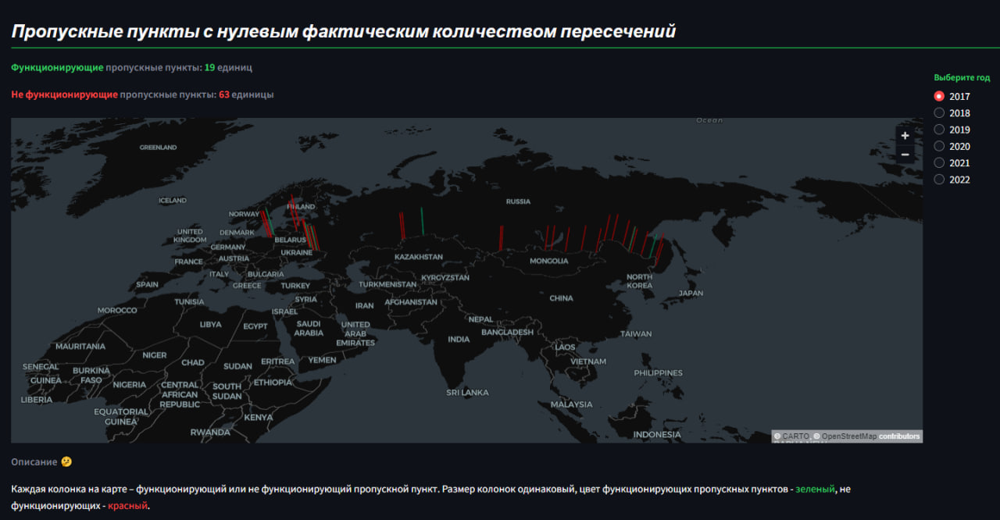
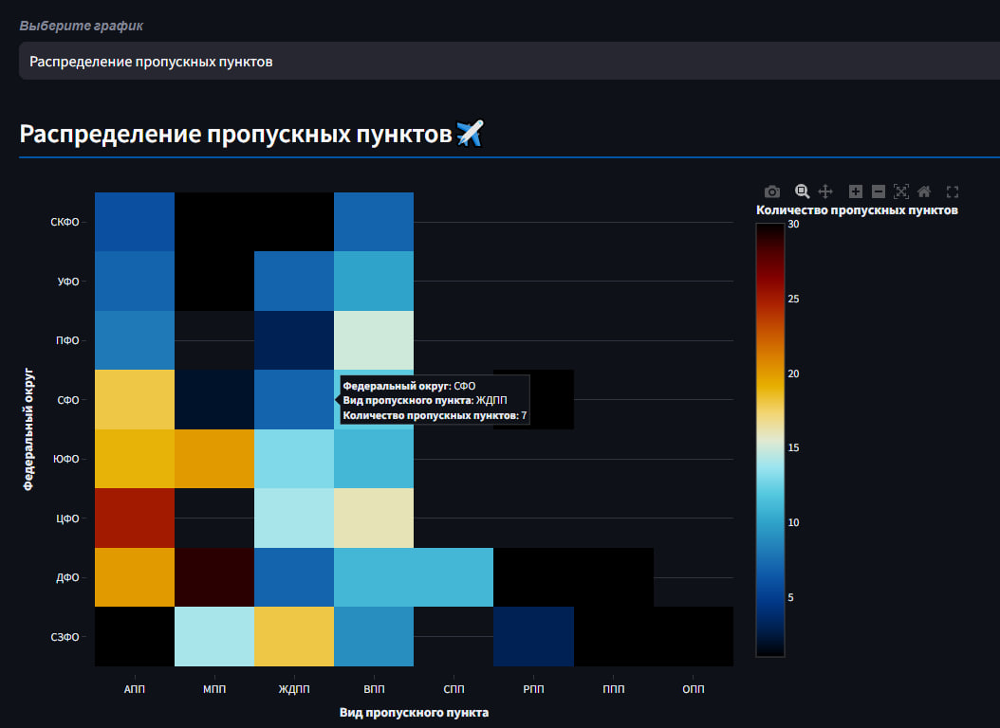
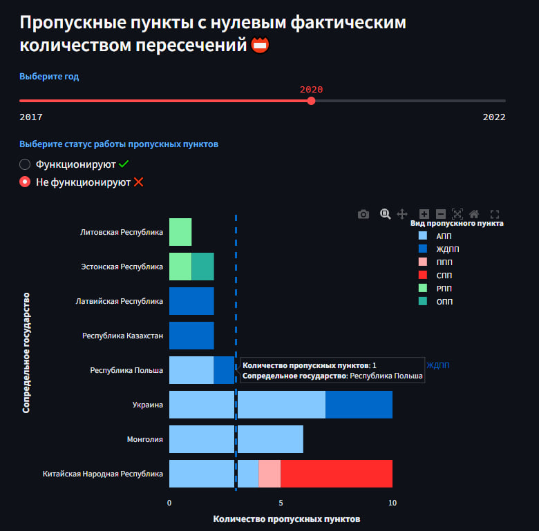

# Визуализация данных по пограничным пропускным пунктам РФ
## Разделы

## Пример из раздела *Карты*

_____________________________________________________________________________

## Пример из раздела *Статистика по Федеральным округам*

_____________________________________________________________________________

## Пример из раздела *Статистика по участкам*

#### В веб-приложении находится статистика по пунктам пропуска через государственную границу РФ за 2017-2022, [данные](data/Копия%20ПП.xlsx) предоставлены Дирекцией по стрфоительству и эксплуатации объектов Росграницы Министерства транспорта РФ

[Сценарии сайта](https://miro.com/app/board/uXjVNh1-bDs=/?share_link_id=76912559185&shareablePresentation=1)

[Посмотреть веб-приложение](https://app-yya23xqsosea2xcovd3wlh.streamlit.app/)
